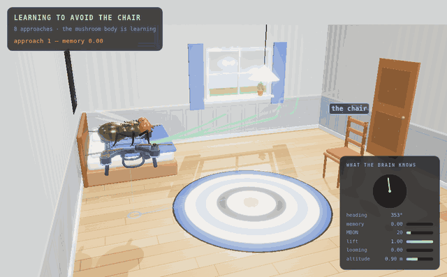

# Watching a flight in 3D

The browser demo flies its own copy of the brain in JavaScript. The mushroom
body and the compass are not in that copy — `engine.js` has no scene code, no
dopamine and no goal — so a learning flight cannot be *flown* in the browser.
It can be *replayed* there, which is what this is:

```bash
flydrones learn --laps 8 --track docs/live/tracks/learn.json   # fly it in Python
python -m http.server -d docs 8000                             # serve the page
open http://localhost:8000/live/replay.html                    # watch it
python tools/record_flight_3d.py --out assets/flight3d.gif --mp4   # record it
```



- [What you are looking at](#what-you-are-looking-at)
- [Making a track](#making-a-track)
- [The track format](#the-track-format)
- [Recording](#recording)
- [The honest part](#the-honest-part)

## What you are looking at

The same bedroom the simulator flies in, built from the same collision boxes,
with the flight drawn into it:

* **the path**, as a tube through the room and its shadow on the floor, coloured
  **blue where the fly had learned nothing** and **green once it had**. The whole
  flight is there faintly from the first frame, so the shape of every approach is
  visible at once; the part already flown is drawn bright over it.
* **the drone**, with the fly riding on it, at the position and heading it
  actually had, tilting with the commands it was actually given.
* **markers** where something happened — an escape, a bump, a lesson, a new goal
  — each with the caption the flight log would have printed, appearing as the
  playhead reaches it.
* **what the brain knew**, on the right: the compass needle (and a dashed marker
  for the goal, when there is one), the memory, the MBON that the memory is
  quietly switching off, lift, looming and altitude.

Space plays and pauses, the arrows step two seconds, and the buttons switch
between the orbit, the chase camera and the drone's own camera — which is the
view the fly's eyes get, and the one the optic flow is computed from.

## Making a track

Any of the flying commands can write one:

```bash
flydrones learn --laps 8 --track flight.json      # the learning experiment, one chapter per approach
flydrones radio --hours 1 --track tonight.json    # a station shift, one chapter per show
flydrones demo --seconds 22 --track demo.json     # the scripted hand demonstration
```

A track is about 1.7 kB per second of flight, so an hour of radio is ~6 MB. The
page takes `?track=` with a URL, so a track anywhere the browser can reach works:

```
live/replay.html?track=/live/tracks/learn.json&theme=night&view=chase
```

## The track format

One JSON object: `title`, `subtitle`, `hz`, `seconds`, `chapters`, `events`,
`fields` and `frames`. Each frame is a flat array in `fields` order, because a
minute of flight is 1,500 rows and the names would be most of the file.

| field | meaning |
|---|---|
| `t` | seconds since the flight started |
| `x`, `y`, `z` | where the drone was, in metres (`z` is up) |
| `yaw` | which way it was pointing, degrees |
| `throttle`, `yaw_cmd`, `forward` | the command the decoder produced, -1..1 |
| `escape` | 1 while the giant-fibre reflex was active |
| `memory` | how much of the KC→MBON weight the fly had given up |
| `heading`, `goal` | the compass bump and the goal it was holding, degrees (-1 = none) |
| `mbon`, `kc` | MBON rate in Hz, fraction of Kenyon cells firing |
| `loom`, `drive` | looming and lift, 0..1 |
| `hit` | 1 on the frame it hit something |

`flydrones.track.load()` reads one back with the rows turned into dicts, which
is the easy way to plot a flight or check one in a test.

## Recording

```bash
python tools/record_flight_3d.py                      # the shipped track -> assets/flight3d.gif
python tools/record_flight_3d.py --track tonight.json --out radio.gif --mp4 \
    --speed 4 --fps 12 --theme night --view chase
```

It serves `docs/`, opens the page in headless Chromium with `?record`, and steps
the replay itself — seek, render, screenshot — so the result does not depend on
how fast the machine draws. Frames become a GIF with ffmpeg's palette filters,
or with Pillow if there is no ffmpeg on `PATH` (Playwright's own ffmpeg build
cannot read a PNG sequence, so it is deliberately not used). `--mp4` writes an
H.264 file next to the GIF, which is a tenth of the size and worth having for
anything longer than about twenty seconds.

Useful knobs: `--speed` (flight seconds per recorded second), `--start`/`--end`,
`--radius`, `--height-m`, `--angle` and `--spin` for the camera, `--colors` and
`--dither` for the GIF's size.

A word about that size. Almost every pixel of a 3D room changes on every frame,
so GIF's delta compression has nothing to work with: the eight-approach flight
at full length and full width is a 70 MB GIF and a 4 MB MP4 of the same
footage. The defaults here (four times speed, twelve frames a second, 560 px,
64 colours) keep it near 5 MB; `assets/flight3d.gif` is the first four
approaches at half that speed so the captions can be read, and
`assets/flight3d.mp4` is the whole flight at full size.

It needs `pip install playwright && playwright install chromium`. Nothing else
in FlyDrones does, which is why it is a tool and not a package extra.

## The honest part

- **A track is a trajectory, not a simulation.** The replay does not re-fly
  anything: it interpolates recorded positions. That is why it survives changes
  to the physics, and why it cannot show you what *would* have happened.
- **The 3D room is a likeness, not the simulator's world.** The furniture
  matches the collision boxes in `drones/sim.py` and the drone is where it
  really was, but the lighting, the textures and the fly on top are decoration.
- **The drone-camera view is not the camera the brain saw.** The brain's retina
  ran on a 96×72 ray-cast render in Python; this is three.js looking the same
  way from the same place.
